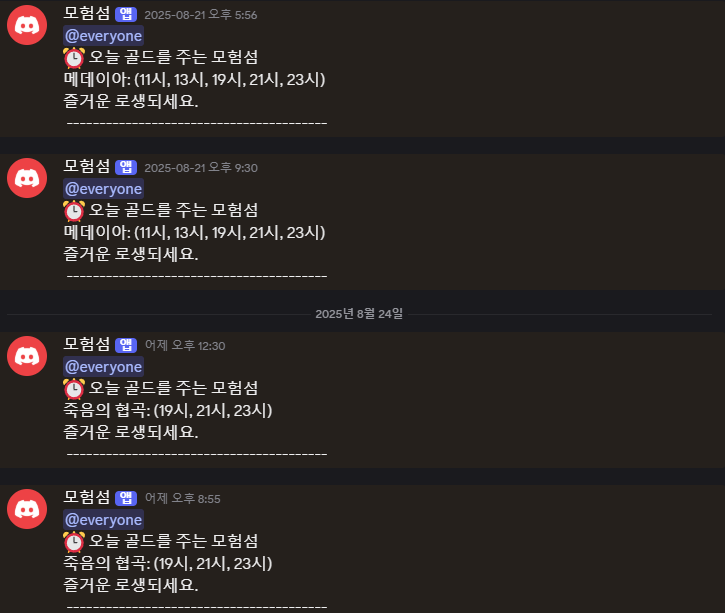

# 🎮 로스트아크 캘린더 디스코드 봇

로스트아크 게임 정보를 제공하는 디스코드 봇입니다. 모험섬 일정, 시장 시세, 공지사항 등을 자동으로 알려주고 사용자 명령어를 통해 실시간 정보를 조회할 수 있습니다.

## ✨ 주요 기능

### 🏝️ 모험섬 알림
- **자동 알림**: 매일 12:30, 20:55에 골드를 주는 모험섬 정보를 자동으로 전송
- **수동 조회**: `!섬` 명령어로 오늘의 골드 모험섬 정보를 즉시 조회

### 💰 시장 시세 조회
- **유물 각인서**: `!유물` 명령어로 유물 각인서 시세 정보를 이미지로 제공 (5분 쿨타임)
- **보석 시세**: `!보석` 명령어로 보석 시세 정보를 이미지로 제공 (5분 쿨타임)

### 🔔 알림 설정
- **개인 알림 설정**: `!역할` 명령어로 개인 채널을 생성하여 골드섬 알림을 켜거나 끌 수 있음
- **공지사항 조회**: `!공지` 명령어로 최신 로스트아크 공지사항을 수동으로 조회

## 📸 사용 예시

### 모험섬 정보 조회
```
!섬
```
**결과**: 오늘의 골드를 주는 모험섬 목록과 시간 정보



### 시장 시세 조회
```
!유물
```
**결과**: 유물 각인서 시세 정보를 테이블 형태의 이미지로 제공
```
!보석
```
**결과**: 보석 시세 정보를 테이블 형태의 이미지로 제공


### 📢 공지사항 알림
- **자동 알림**: 매주 수요일 10:02에 로스트아크 공지사항을 자동으로 전송
- **수동 조회**: `!공지` 명령어로 최신 공지사항을 즉시 조회


### 🔔 개인 알림 설정
```
!역할
```
**결과**: 개인 전용 채널이 생성되고, 버튼을 통해 골드섬 알림을 켜거나 끌 수 있음

## 🚀 설치 및 실행

### 필수 요구사항
- Node.js 18.0.0 이상
- npm 또는 yarn

### 1. 저장소 클론
```bash
git clone https://github.com/gudrn/lostarkcalendar.git
cd lostarkcalendar
```

### 2. 의존성 설치
```bash
npm install
# 또는
yarn install
```

### 3. 환경변수 설정
`.env` 파일을 생성하고 다음 정보를 입력하세요:

```env
# Discord 봇 토큰
DISCORD_TOKEN=your_discord_bot_token

# 로스트아크 API 설정
LOSTARK_API_BASE=https://developer-lostark.game.onstove.com
LOSTARK_API_KEY=your_lostark_api_key

# 디스코드 채널 ID
CHANNEL_ID=your_channel_id_for_islands
CHANNEL_ID2=your_channel_id_for_notices

# 시장 설정 (선택사항)
RELIC_MAX_PAGES=4
RELIC_TOP_N=50
```

### 4. 봇 실행
```bash
# 개발 모드 (자동 재시작)
npm run dev

# 프로덕션 모드
node index.js
```

## 📋 사용법

### 봇 명령어

| 명령어 | 설명 | 쿨타임 |
|--------|------|---------|
| `!섬` | 오늘의 골드 모험섬 정보 조회 | 없음 |
| `!유물` | 유물 각인서 시세 조회 | 5분 |
| `!보석` | 보석 시세 조회 | 5분 |
| `!공지` | 최신 로스트아크 공지사항 조회 | 없음 |
| `!역할` | 개인 채널에서 골드섬 알림 설정 | 없음 |

### 자동 알림 스케줄

- **모험섬 알림**: 매일 12:30, 20:55
- **공지사항 알림**: 매주 수요일 10:02

### 개인 알림 설정

`!역할` 명령어를 사용하면 개인 전용 채널이 생성되며, 해당 채널에서 골드섬 알림을 켜거나 끌 수 있습니다.

1. `!역할` 명령어 입력
2. 개인 채널에서 버튼을 클릭하여 알림 설정
3. 설정한 알림 상태에 따라 골드섬 알림 수신 여부 결정

## 🏗️ 프로젝트 구조

```
lostarkcalendar/
├── apis/                 # API 관련 모듈
│   ├── gameContentApi.js # 게임 콘텐츠 API
│   ├── noticesApi.js     # 공지사항 API
│   └── relicAutionApi.js # 유물 경매장 API
├── assets/               # 폰트 등 정적 자원
│   └── fonts/            # 폰트 파일
├── commands/             # 봇 명령어 핸들러
│   ├── island.js         # 모험섬 명령어
│   ├── market.js         # 시장 시세 명령어
│   ├── notice.js         # 공지사항 명령어
│   └── role.js           # 역할 설정 명령어
├── config/               # 설정 파일
│   └── config.js         # 환경변수 및 설정
├── constants/            # 상수 정의
│   ├── gemstones.js      # 보석 상수
│   ├── marketCodes.js    # 시장 코드
│   └── relics.js         # 유물 상수
├── fetchers/             # 데이터 수집기
│   ├── gemstoneFetcher.js # 보석 데이터 수집
│   ├── islandFetcher.js   # 모험섬 데이터 수집
│   └── relicFetcher.js    # 유물 데이터 수집
├── handles/              # 메시지 처리 핸들러
│   └── messageHandle.js   # 메시지 핸들러
├── images/               # 이미지 파일
├── processors/           # 데이터 처리기
│   ├── islandProcessor.js # 모험섬 데이터 처리
│   ├── noticeProcessor.js # 공지사항 데이터 처리
│   └── relicProcessor.js  # 유물 데이터 처리
├── services/             # 스케줄러 등 서비스
│   └── scheduler.js       # 자동 알림 스케줄러
├── utils/                # 유틸리티 함수
│   ├── canvas/           # 캔버스 관련 유틸
│   ├── mapper/           # 데이터 매핑
│   └── *.js              # 기타 유틸리티
└── index.js              # 메인 진입점
```

## 🔧 기술 스택

- **런타임**: Node.js 18.0.0+
- **Discord API**: discord.js v14.21.0
- **스케줄링**: node-schedule v2.1.1
- **HTTP 클라이언트**: axios v1.10.0
- **이미지 생성**: canvas v3.1.2
- **환경변수**: dotenv v17.2.0
- **개발 도구**: nodemon v3.1.10
- **프로세스 관리**: pm2 v6.0.8

## 📝 환경변수 설명

| 변수명 | 설명 | 필수 여부 |
|--------|------|-----------|
| `DISCORD_TOKEN` | Discord 봇 토큰 | ✅ 필수 |
| `LOSTARK_API_BASE` | 로스트아크 API 기본 URL | ✅ 필수 |
| `LOSTARK_API_KEY` | 로스트아크 API 키 | ✅ 필수 |
| `CHANNEL_ID` | 모험섬 알림 채널 ID | ✅ 필수 |
| `CHANNEL_ID2` | 공지사항 알림 채널 ID | ✅ 필수 |
| `ROLE_ID` | 골드섬 알림용 역할 ID | ✅ 필수 |
| `RELIC_MAX_PAGES` | 유물 검색 최대 페이지 수 | ❌ 선택 |
| `RELIC_TOP_N` | 유물 검색 결과 상위 개수 | ❌ 선택 |

